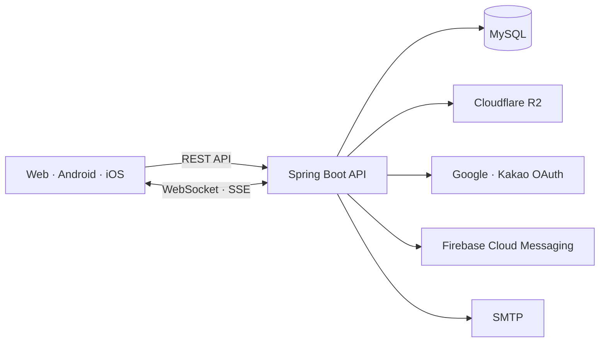

<div align="center">
  <a href="https://zzoin.me">
    
  </a>

  <h3>대학생 프로젝트 팀원 연결 서비스</h3>
  <p>대학생의 아이디어와 기술을 프로젝트로 연결하는 Zzoin의 백엔드 서버</p>

  <p>
    
    
    
    
    <a href="./LICENSE"></a>
  </p>

  <p>
    <a href="https://app.notion.com/p/zzoin/API-3b261ab28946809c8d22c142d22d133b"><strong>API Docs</strong></a>
    &nbsp;·&nbsp;
    <a href="https://app.notion.com/p/zzoin/3a261ab28946806e931ee227bde6aae8"><strong>Project Notion</strong></a>
    &nbsp;·&nbsp;
    <a href="https://app.notion.com/p/3a261ab28946801ca17fdcfaa8ba3ce2"><strong>ERD</strong></a>
  </p>
</div>

---

## Zzoin을 뒷받침하는 API

학교별 커뮤니티에 흩어진 팀원 모집, 확인하기 어려운 기술 스택, 여러 서비스로 나뉘어 사용했던 지원·연락 과정을 하나의 흐름으로 연결합니다. Zzoin 백엔드는 계정과 대학 인증부터 프로젝트 매칭, 커뮤니티, 실시간 협업까지 서비스 전반의 데이터와 비즈니스 로직을 담당합니다.

> **캠퍼스의 경계를 넘어, 당신의 아이디어가 완벽한 포트폴리오가 되는 곳**

## 주요 기능

| 영역 | 주요 기능 |
| --- | --- |
| 🔐 **인증과 계정** | 이메일 및 Google·Kakao 소셜 로그인, 계정 연결, 토큰 관리, 계정 탈퇴와 복구 절차 |
| 🎓 **신뢰 기반 프로필** | 대학 이메일 인증, 직군·기술 스택·프로필 및 사용자 평가 관리 |
| 🚀 **프로젝트 매칭** | 추천, 인기, 직군별 필터링과 프로젝트 상태 관리 |
| 💬 **커뮤니티** | 게시글과 이미지, 댓글·대댓글, 좋아요와 저장 |
| ⚡ **실시간 협업** | WebSocket 활용한 실시간 프로젝트 대화, SSE·FCM 알림 |
| 🗄️ **데이터와 파일** | MySQL·Flyway DB 관리 및 Cloudflare R2 연동 |

## 백엔드 구조



## Zzoin 둘러보기

| 문서 | 내용 |
| --- | --- |
| [API 명세서](https://app.notion.com/p/zzoin/API-3b261ab28946809c8d22c142d22d133b) | 엔드포인트, 요청·응답과 공통된 타입 목록 |
| [프로젝트 문서](https://app.notion.com/p/zzoin/3a261ab28946806e931ee227bde6aae8) | 기획 의도, MVP, 사이트맵, 기능 명세서, UseCase, FlowDiagram, API 명세서 |
| [ERD](https://app.notion.com/p/3a261ab28946801ca17fdcfaa8ba3ce2) | 데이터 모델과 엔티티 관계도 |


## 로컬에서 시작하기

> Java와 MySQL이 설치되어 있어야 합니다.

[application.example.properties](application.example.properties) 파일을 복사하여 `application.properties`로 변경합니다.

아래 명령어를 사용하여 빌드 후 실행합니다.

```bash
cp application.example.properties application.properties
./gradlew bootRun
```


---

<p align="center">
  <sub>Copyright 2026 Zzoin · <a href="./LICENSE">Apache License 2.0</a></sub>
</p>
